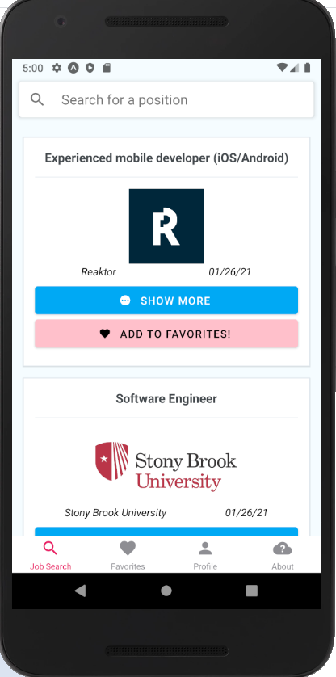
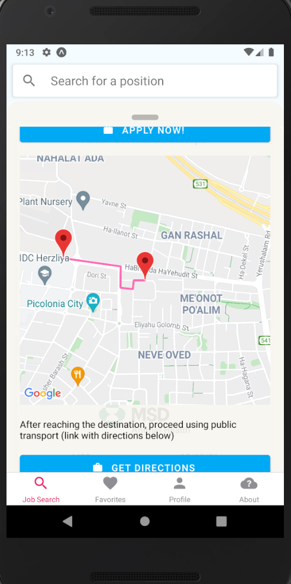

# JOBUS 

Final Project - Computer Science @ Ruppin Academic Center.

**JOBUS** is a job seeking application focused on every day route to the workplace.  
UI Written in React Native (Expo) with a .NET + MSSQL backend and a separate logical route service.

Natanel Endelshtein  
Alex Kalenyuk

**Note**:  
Server-side code is located under [`backend-code`](backend-code), and queries are at [`native_final_queries.sql`](native_final_queries.sql).

## Plugins

### Major

- Location
- Maps (react-native-maps/react-native-maps-directions)
- ImagePicker
- BottomSheet Modal (Swipeable modal, 'reanimated-bottom-sheet')
- WebView (react-native-render-html)
- Firebase
- Splash Screen

### Minor

- AsyncStorage
- Constants
- Linking
- Permissions

